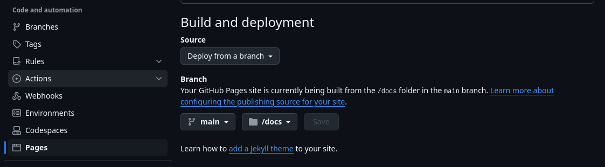

# Overview

This `README.md` contains information related to the Github Pages Deployment project in Devops roadmap,
seen here <https://roadmap.sh/projects/github-actions-deployment-workflow>.

## Project Description

This project is a simple static site that is deployed to Github Pages using Github Actions.

In an attempt to keep all projects related to this track in one repo, the `README.md` for this project is located here (obviously), but the actual structure of the project exists elsewhere in the repo.

GitHub pages will allow you to deploy a static site (just an `index.html` file) from two places in a repo: the root of the repo `/`, or a `docs/` folder in the root of the repo.

This project chose to use the `docs/` folder for this deployment, where you can view the `index.html` file that is deployed [here](../../docs/index.html).

The actual workflow defined in this project can be found [here](../../.github/workflows/static_deploy.yml).

This workflow was largely lifted from the Github actions starter worflows seen here, with minor modifications related to when to deploy the site: <https://github.com/actions/starter-workflows/blob/main/pages/static.yml>

Finally, Github had to be configured to deploy the site from the `docs/` folder in the repo. This was done in the settings of the repo, under the `Pages` section. A picture of this configuration can be seen below:

## Deployed Site

The deployed site can be found [here](https://eecs.github.io/devops_roadmap/).
