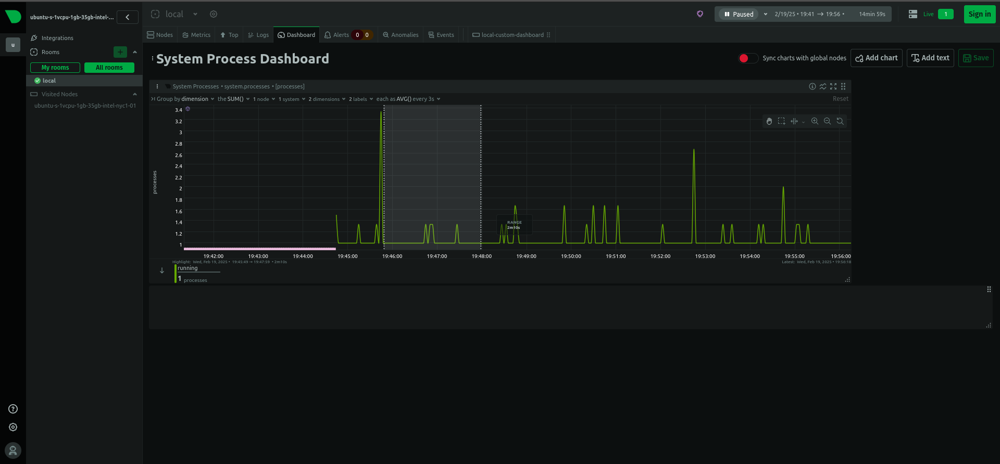

# Overview

This project is about setting up a simple monitoring dashboard using Netdata. The project is part of the DevOps track on [roadmap.sh](https://roadmap.sh).

## Requirements

Below, you will find the requirements for this project:

- Install Netdata on a Linux system.
- Configure Netdata to monitor basic system metrics such as CPU, memory usage, and disk I/O.
- Access the Netdata dashboard through a web browser.
- Customize at least one aspect of the dashboard (e.g., add a new chart or modify an existing one).
- Set up an alert for a specific metric (e.g., CPU usage above 80%).

Once the above requirements are met, the following shell scripts should be created:

- `setup.sh`: A shell script to install Netdata on a new system.
- `test_dashboard.sh`: Script to put some load on the system and test the monitoring dashboard.
- `cleanup.sh`: Script to clean up the system and remove the Netdata agent.

## Steps Taken

1. Installed Netdata on a DigitalOcean droplet running Ubuntu 20.04.
   - To do this, I ran the following commands:
     - `curl https://get.netdata.cloud/kickstart.sh > /tmp/netdata-kickstart.sh && sh /tmp/netdata-kickstart.sh`
2. Customized the Netdata dashboard by adding a new chart.
    - I added a new chart to monitor the number of processes running on the system, seen here: 
    
    
3. Set up an alert for CPU usage above 80%.
    - I configured an alarm in Netdata to trigger when the CPU usage exceeds 80%.
    - I tested the alert by putting some load on the system and observing the alert in the dashboard.
    I simulated high CPU usage by running a stress test on the system using the `stress` command with `--cpu 1 --timeout 60s` to stress 1 core for 60 seconds.