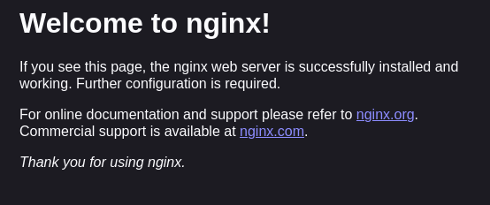

# Overview

This project is about setting up a remote server using SSH. The project is part of the DevOps track on [roadmap.sh](https://roadmap.sh).

## Requirements

Here are the requirements for this project:

- Register and setup a remote linux server on any provider
- Make sure that you can connect to your server using SSH.
- Install and configure nginx to serve a static site.
- Create a simple webpage with basic HTML, CSS and image files.
- Use rsync to update a remote server with a local static site.
- If you have a domain name, point it to your server and serve your static site from there. Alternatively, set up your nginx server to serve the static site from the server’s IP address.

## Steps Taken

This project involved setting up a remote server on DigitalOcean and configuring it to serve a static site using Nginx. The following steps were taken:

1. Created a droplet on DigitalOcean.
2. Generated an SSH key pair on the local machine.
3. Copied the public key to the server.
4. Connected to the server using SSH.
5. Installed Nginx on the server.
   - To do this, I ran the command `sudo apt update` to update the package list.
   - I then ran the command `sudo apt install nginx` to install Nginx.
   - Next, I adjusted the firewall settings to allow HTTP and HTTPS traffic.
     - To see a list of applications that ufw knows how to work with, I ran the command `sudo ufw app list`.
     - I ran the command `sudo ufw allow 'Nginx Full'` to allow both HTTP and HTTPS traffic.
     - I then ran the command `sudo ufw status` to check the status of the firewall.
     - I then ran the command `sudo systemctl status nginx` to check the status of the Nginx service.
     - I then navigated to the server's IP address in a web browser to confirm that Nginx was installed correctly, seeing this picture: 
6. Created a simple webpage with basic HTML, CSS, and image files.
7. Used rsync to update the remote server with a local static site.
   - To do this, I ran the command `rsync -avz <path/to/site> user@<ip-address-of-droplet>:/var/www/html/`.
     - `-a` preserves the permissions and other directory properties.
     - `-v` enables verbose mode.
     - `-z` compresses the data for transfer.
8. Because I do not have a domain name for this project, I did not create a new nginx config file to serve the static site from (as can be seen [here](https://www.digitalocean.com/community/tutorials/how-to-install-nginx-on-ubuntu-20-04#step-5-setting-up-server-blocks-recommended)). Instead, I modified the default Nginx configuration file to serve the static site from the server's IP address.
   - To do this, I ran the command `sudo vim /etc/nginx/sites-available/default` to edit the default Nginx configuration file.
   - I then modified the `root` directive to point to the location of the static site on the server.
   - I then ran the command `sudo nginx -t` to test the Nginx configuration.
   - I then ran the command `sudo systemctl reload nginx` to apply the changes.
   - I then navigated to the server's IP address in a web browser to confirm that the static site was being served correctly.
9. Finally, I wrote a deploy script, `deploy.sh`, to automate the deployment process. The script contains the rsync command to update the remote server with the local static site.
